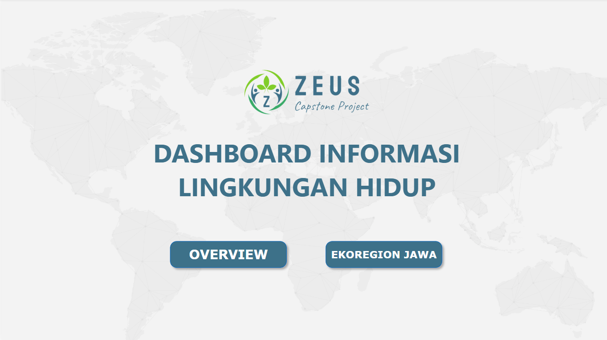
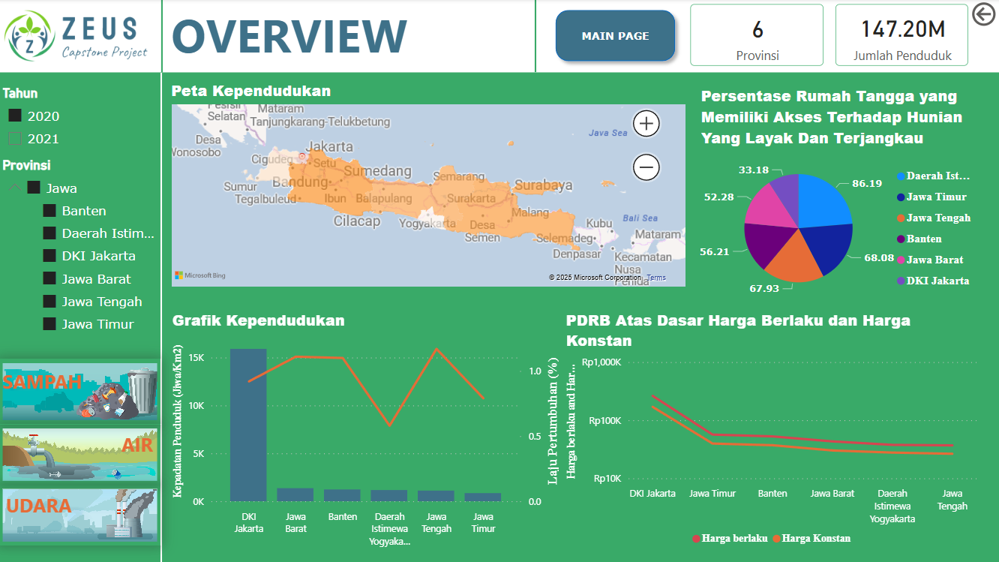
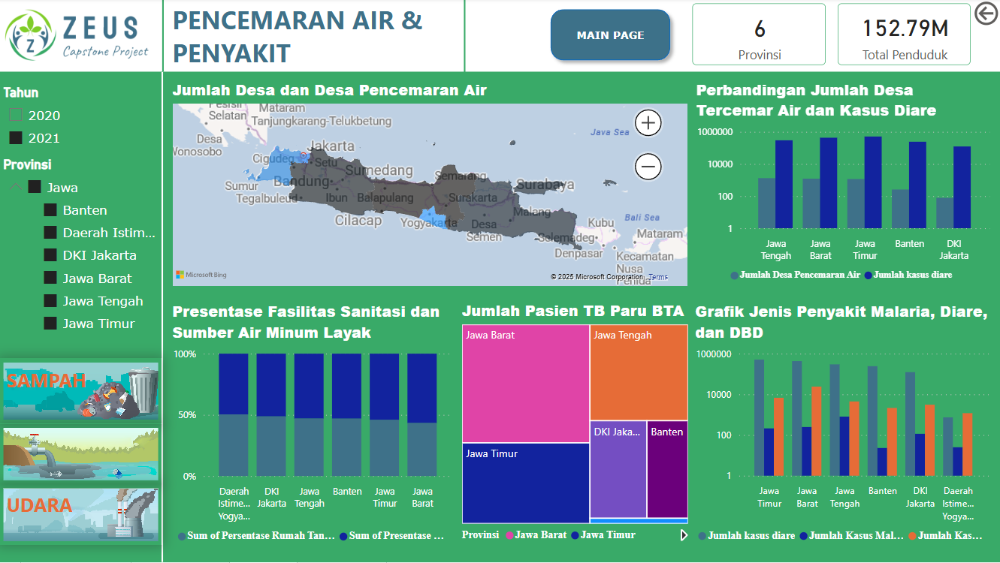
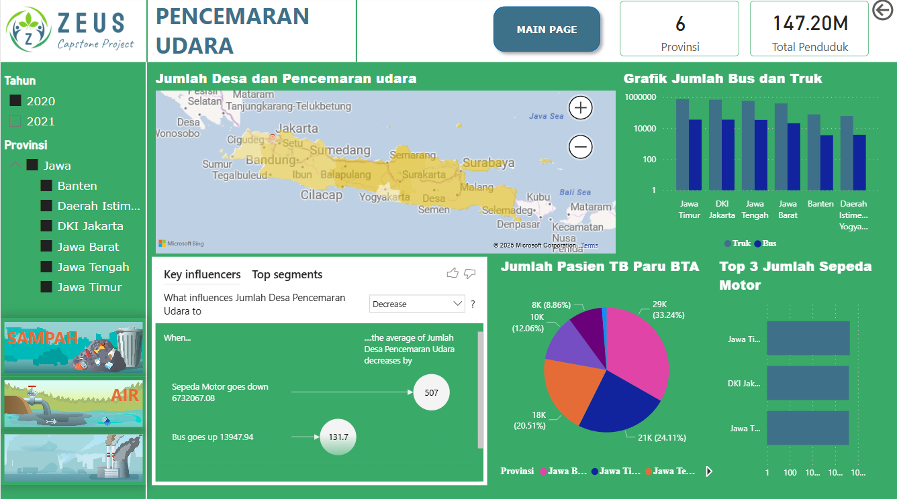
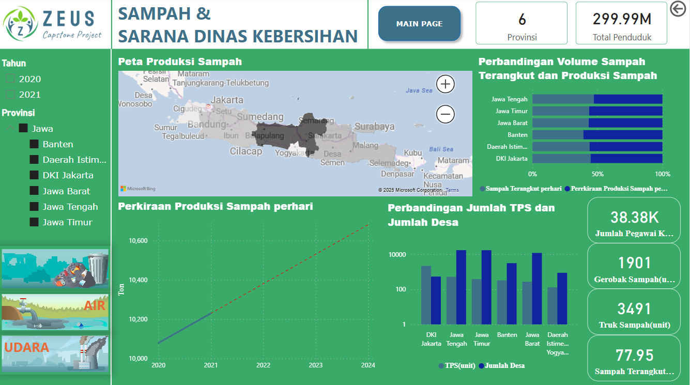

# 🌱 Environmental Dashboard: Pulau Jawa (Power BI)

Proyek ini merupakan bagian dari program Studi Independen Bersertifikat (MSIB) pada track Data Analyst & AI di PT Maribelajar Indonesia Cerdas. Dashboard yang dibuat menyajikan informasi lingkungan hidup di wilayah ekoregional Pulau Jawa sebagai bentuk partisipasi dalam mendukung program Pembangunan Berkelanjutan.

## 📌 Latar Belakang

Lingkungan hidup yang sehat berperan penting dalam mendukung produktivitas dan kualitas hidup masyarakat. Dashboard ini dikembangkan untuk menyampaikan data dan insight terkini mengenai kondisi lingkungan di Pulau Jawa. Tujuan utamanya adalah memberikan informasi yang dapat digunakan oleh masyarakat dan pemerintah dalam pengambilan keputusan strategis yang tepat.

## 🎯 Tujuan Proyek

- Menyediakan data lingkungan hidup yang mudah diakses dan dipahami oleh publik
- Membantu pemerintah dan masyarakat dalam mengevaluasi kondisi lingkungan saat ini
- Mendukung upaya edukasi dan transparansi dalam pembangunan berkelanjutan

## 🛠 Tools dan Teknologi

- Microsoft Power BI (utama untuk visualisasi)
- Microsoft Excel (pengolahan data mentah)
- Microsoft Word (penyusunan laporan proyek)
- Sumber Data: Statistik Lingkungan Hidup Indonesia (BPS)

## 📊 Fitur Dashboard

- Peta sebaran kualitas lingkungan hidup per provinsi
- Grafik kependudukan berdasarkan wilayah
- Presentase rumah tangga dengan akses hunian layak
- Tampilan Produk Domestik Regional Bruto (PDRB) atas dasar harga berlaku & konstan
- Filter interaktif berdasarkan provinsi dan tahun (2020–2021)

## 👥 Anggota Kelompok

- R. Farhan Ardwinata S [4975203 / Universitas Diponegoro]
- Neza Zhevira Septiani [4601914 / Universitas Diponegoro]
- Nirmalito Fatehah Nitinegari [5241153 / Universitas Diponegoro]
- Tya Dwi Rahayu [4729369 / Universitas Diponegoro]

## 🧠 Peran Saya dalam Proyek

- Membersihkan dan memvalidasi data lingkungan (menghapus duplikasi, menangani missing value, memastikan konsistensi)
- Mendesain halaman dashboard interaktif untuk kondisi perairan Pulau Jawa menggunakan Power BI
- Menyusun bagian laporan: latar belakang, spesifikasi kebutuhan, dan diagram alir solusi
- Menjadi presenter utama saat final presentation, menyampaikan proses, insight, dan menjawab pertanyaan panelis

## 📄 File yang Disertakan

- [`Capstone_Project_Zeus.pbix`](Capstone_Project_Zeus.pbix) – File dashboard Power BI
- [`Kelompok_Zeus_Laporan_Capstone_Project.pdf`](Kelompok_Zeus_Laporan_Capstone_Project.pdf) – Laporan Capstone Project Kelompok Zeus

## 🖼️ Preview Dashboard

Halaman Utama  
Overview  
Pencemaran Air & Penyakit  
Pencemaran Udara  
Sampah & Sarana Dinas Kebersihan  

## 🔗 Referensi dan Dokumentasi Tambahan

- 📊 Sumber Data: [Statistik Lingkungan Hidup Indonesia 2022 - BPS](https://www.bps.go.id/id/publication/2022/11/30/eb06d1c8e37285cac10c3086/statistik-lingkungan-hidup-indonesia-2022.html)
- 🎤 Video Pitching Proyek: [YouTube - Pitching](https://youtu.be/Ht2CC7Me0oU?si=-Uw_4d0jte9aQT-E)
- 🖥️ Video Demonstrasi Dashboard: [YouTube - Demo](https://youtu.be/HlznwahUSjk?si=lyj7cjaIuVKxNu8J)

## 📚 Insight Kunci

- Visualisasi interaktif yang mendukung pengambilan keputusan berbasis wilayah dan waktu
- Tampilan data lingkungan yang menyeluruh mulai dari kependudukan hingga PDRB
- Penyajian data dengan cara yang mudah dipahami oleh masyarakat dan pemerintah

## 👩‍💻 Tentang Saya

Saya Tya Dwi Rahayu, lulusan Fisika yang sedang membangun karier di bidang Data & IT.  
Saya memiliki ketertarikan dalam analisis data, visualisasi, dan data storytelling menggunakan Excel, Power BI, dan tools analisis lainnya.

---

📫 Jangan ragu untuk menghubungi saya jika ingin berdiskusi atau berkolaborasi dalam proyek data lainnya!
